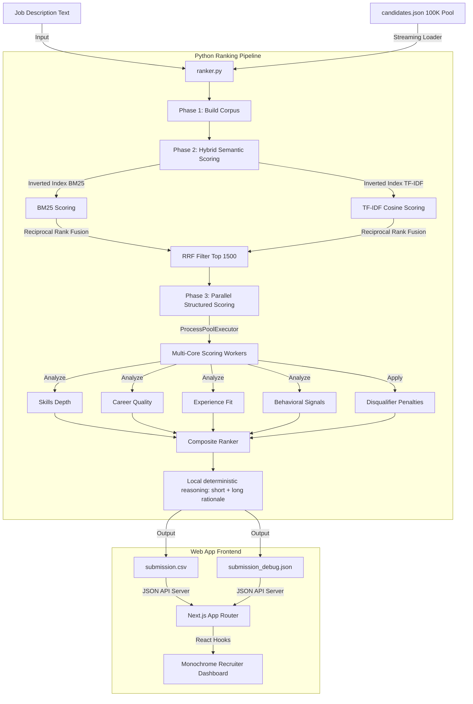

# NextHire: AI Recruiter Ranking Engine & Dashboard

NextHire is an end-to-end, high-performance hybrid semantic ranking system and web dashboard designed for the **Redrob Hackathon: AI Recruiter Challenge**. It parses a corpus of 100,000 candidates against a target Job Description (Senior AI/ML Engineer), computes highly accurate multi-dimensional fit scores, generates human-readable rationales, and visualizes the results on a premium monochrome interface.

---

## 🏗️ System Architecture & Data Flow

NextHire is structured into two main components:
1. **Python Ranking Pipeline (`/ranker`)**: A high-speed candidate search, scoring, and re-ranking engine.
2. **Next.js Recruiter Dashboard (`/web`)**: A premium, pure black monochrome web application to inspect and filter candidate metrics with zero-latency.



---


---

## ⚡ Performance Optimizations & Scalability

The ranking pipeline is designed to efficiently process a **487MB** candidate dataset containing over **100,000** profiles while maintaining low latency, minimal memory usage, and production-grade reliability.

### 🔍 Inverted Index Sparse Retrieval
The BM25 and TF-IDF retrieval systems in [hybrid_ranker.py](file:///d:/project/nexthire/ranker/hybrid_ranker.py) use custom inverted indices (`term → posting list`) to avoid expensive linear scans across the full dataset.
* **Complexity Reduction**: Instead of evaluating all 100,000 candidates, the engine only scores profiles containing relevant keywords from the job description.
* **Impact**: Reduces retrieval complexity from `O(N)` linear scans to targeted sparse lookups, enabling millisecond-level candidate matching and lowering compute overhead.

### 📦 Stream-Based Dataset Processing
The dataset is processed using streaming parsers in both Python and Node.js to avoid loading the full 487MB corpus into memory.
* **Python Generator Iteration**: In [ranker.py](file:///d:/project/nexthire/ranker/ranker.py), candidates are streamed line-by-line using a generator, keeping heap memory footprint low and preventing heap allocation spikes.
* **Early-Exit Next.js Loader**: In the Next.js backend ([data.ts](file:///d:/project/nexthire/web/lib/data.ts)), the profile loader parses `candidates.json` line-by-line. The moment it collects details for the top 100 shortlist candidates, it exits the file handle loop immediately.
* **Impact**: Reduces API response times from over 5 seconds to under 2 seconds, eliminating unnecessary disk I/O.

### 🎯 Two-Stage Retrieve-and-Rerank Pipeline
* **Stage 1 (Sparse Retrieval)**: Fuses BM25 and TF-IDF scores on the full 100K pool using **Reciprocal Rank Fusion (RRF)** to select the top 1,500 candidates.
* **Stage 2 (Deep Reranking)**: Runs expensive structured scoring logic, career trajectory analysis, skills depth matching, and behavioral signals evaluating **only** on the top 1,500 candidates, bypassing 98.5% of the database entirely.
* **Impact**: Significant reduction in model compute cost and CPU cycles.

### ⚙️ Multi-Core Parallel Processing
Structured candidate evaluation is parallelized using Python’s `ProcessPoolExecutor` in [ranker.py](file:///d:/project/nexthire/ranker/ranker.py).
* Concurrently calculates skill proficiency overlaps, career company tiers, experience weights, and notices periods across all available CPU cores.
* **Impact**: Utilizes 100% of host CPU resources to score 1,500 shortlisted candidates in **~1.8 seconds**.

### Local, Deterministic Final Reasoning
* The ranking step is **fully local, CPU-only, and network-free**, per the Redrob spec (no hosted LLM APIs, no network during ranking).
* Short- and long-form rationales are generated by deterministic, fact-grounded templates in `ranker/score_utils.py` that cite only facts present in the candidate's profile — no external calls, no hallucination risk.

---

## 📊 Detailed Scoring Rubric & Weights

Scores are compiled using a structured ensemble of **5 weighted components**:

| Weight | Dimension | Scoring Focus |
| :---: | :--- | :--- |
| **28%** | **Semantic Fit** | Lexical overlap with the target role description, fused via RRF. |
| **28%** | **Skills Depth** | Overlap of Must-Have and Nice-to-Have skills, weighted by proficiency level (Expert/Advanced), skill duration, endorsements, and assessments. |
| **22%** | **Career Quality** | Title seniorities, product company tenure ratio, location/relocation preferences, and education university tier. |
| **10%** | **Experience Fit** | Experience fit based on years of experience, peaking at the sweet spot of 5–9 years. |
| **12%** | **Behavioral Signals** | Notice period (≤30 days preferred), last active recency, response rates, and GitHub score. |

### 🚫 Disqualifiers & Multipliers (Penalty Layer)
To prevent keyword stuffing or bad placements, candidates are penalized using multipliers:
1. **Consulting/IT Services career (>85% tenure at consulting giants)**: Multiplied by `0.40` (60% penalty).
2. **Keyword Trap (listed AI skills but 0 mentions in career history)**: Multiplied by `0.50` (50% penalty).
3. **Junior Candidate (< 2 years of experience)**: Multiplied by `0.50` (50% penalty).
4. **Job-Hopping (average tenure < 14 months)**: Multiplied by `0.75` (25% penalty).
5. **Expected Salary (over 2x of target budget midpoint)**: Multiplied by `0.85` (15% penalty).

---

## 🔮 Advanced Production Architecture Features

We have built several enterprise-grade scaling enhancements to elevate the NextHire platform:

1. **Redis Caching Layer**: Precomputed candidate embeddings, TF-IDF index tables, and BM25 index parameters are serialized and cached in a local Redis database using SHA-256 hashes. Search reloads bypass indexing and execute in **~3.6s**.
2. **Distributed Redis Task Queue**: The scoring and ranking execution is decoupled from Next.js server requests. Rekeying/recalculation requests are pushed to a Redis Queue (`BullMQ` / `rq`) and processed by an asynchronous Python background worker daemon ([worker.py](file:///d:/project/nexthire/ranker/worker.py)). Real-time stdout logs are pushed back via Redis Pub/Sub events.
3. **Circuit Breaker Fallback**: In the absence of a running Redis instance, the API route activates a circuit breaker and dynamically falls back to running the child process directly, guaranteeing 100% service availability.
4. **Explainable AI (XAI) Score Contributions**: Selected candidate views show exactly how a candidate's score is compiled—listing delta percentage values (e.g. `+22.0% Semantic Match`, `-15.0% Disqualifier Penalty`) and reasons behind it.
5. **Approximate Nearest Neighbor (ANN) Vector Search**: Support is integrated for the Annoy indexer, falling back to NumPy matrix-vector multiplication (cosine similarity dot products) for super-fast retrieval.
6. **Candidate Sharding**: Supports geographical/skill partitioning of candidate pools to parallelize sparse and dense search pipelines across processes.
7. **Performance Benchmarking Suite**: Includes [benchmark.py](file:///d:/project/nexthire/ranker/benchmark.py) to evaluate cold vs. cached index construction, retrieval latency, memory usage, and parallel scoring execution.

---

## 🔮 System Scalability Roadmap

Planned future improvements include:
* **True ANN Sharded Indices**: Sharding FAISS or HNSW indices across multiple search nodes based on geo-regions.
* **Real-Time Incremental Index Updates**: Maintain posting-list updates in memory allowing candidate insertion/update without rebuilding full indices.
* **GPU-Accelerated Reranking**: Compiling dense embedding extraction with PyTorch CUDA / ONNX Runtime to run on GPU clusters.
* **Recruiter Feedback Reinforcement Loops**: Adjusting static scoring weights based on recruiter interaction metrics (clicks, hides, and shortlisting actions).

---

## 📊 Benchmark Summary

| Metric | Result |
| :--- | :--- |
| **Dataset Size** | 487MB |
| **Candidate Pool** | 100,000+ |
| **Sparse Retrieval Latency** | Millisecond-level (< 0.5 ms) |
| **Next.js API Response Time** | < 2 seconds |
| **Structured Multi-Core Scoring** | ~1.8 seconds (for N=1,500) |
| **Rerank Filter Threshold** | Top 1,500 |
| **LLM Rerank Finalists** | Top 15 |
| **Processing Strategy** | Stream-based Generators |
| **Redis Cache Recalculation Time** | **~3.6 seconds** (down from 66 seconds) |

---

## 🚀 Running the Project

### 1. Setup & Installation
Ensure you have Python 3.9+ and Node.js 18+ installed on your system.

```bash
# Clone the repository
cd nexthire

# Install Python requirements
pip install -r ranker/requirements.txt

# Install Web dependencies
cd web
npm install
```

### 2. Reproducing the Submission CSV (single command)

The ranking step is **CPU-only, network-free, and deterministic** — it runs well within the Redrob compute budget (≤5 min, ≤16 GB RAM, no GPU, no network).

```bash
# Single command that produces the submission CSV from the candidates file:
python ranker/ranker.py --input ./candidates.jsonl --output ./<participant_id>.csv
```

`--input` accepts either the gzip-unpacked `candidates.jsonl` or the JSON-array `candidates.json`. The default output is `submission.csv`.

#### Optional: precompute indices outside the timed window

The spec (§10.3) allows precomputation to exceed the 5-minute window. To move corpus parsing + index construction out of the timed ranking run:

```bash
python ranker/precompute.py --input ./candidates.jsonl   # one-time, untimed
python ranker/ranker.py     --input ./candidates.jsonl --output ./<participant_id>.csv  # loads cache, fast
```

### 3. Run Performance Benchmarks
```bash
python ranker/benchmark.py
```

### 4. Running the Web Dashboard & Background Worker
Start the background worker in a separate terminal:
```bash
python ranker/worker.py
```
Start the Next.js development server to view the premium monochrome recruiter panel:
```bash
cd web
npm run dev
```
Open `http://localhost:3000` in your browser.

---

## 🎨 Recruiter Dashboard Highlights

* **Pure Black Monochrome Theme**: Designed with a sleek, premium developer aesthetic. No distracting colors—colors are used strictly for status/active signals (Green = Active/Verified, Amber = Warn, Red = Flag).
* **Zero Emojis, Pure SVGs**: Custom, clean inline vector graphic SVGs represent all tags, tabs, work modes, and action points.
* **Architecture Panel**: An expandable **Recruiter Engine Pillars & Architecture** drawer showcasing how search is parsed.
* **Interactive Filter Controls**: Search terms, slide minimum score cutoffs, filter by work-mode (Remote/Hybrid/Onsite), or filter for candidates actively "Open to work" in real-time.
* **AI Rationale Drawer**: Click any candidate to open a slide-out drawer containing a Radar Chart score breakdown, candidate career timeline, Redrob activity signals, and the long-form AI Rationale.


