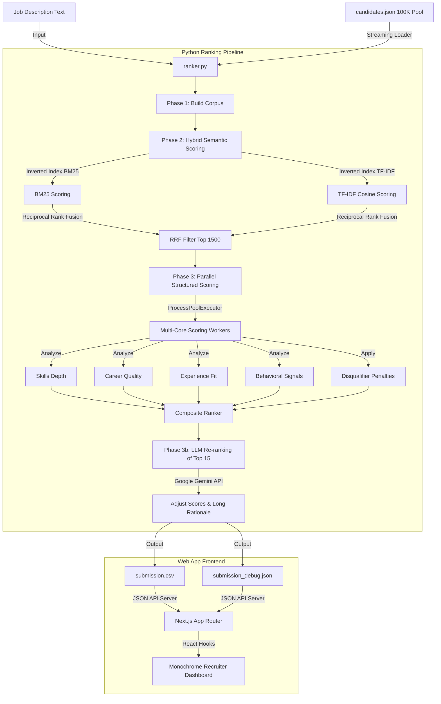

# NextHire: AI Recruiter Ranking Engine & Dashboard

NextHire is an end-to-end, high-performance hybrid semantic ranking system and web dashboard designed for the **Redrob Hackathon: AI Recruiter Challenge**. It parses a corpus of 100,000 candidates against a target Job Description (Senior AI/ML Engineer), computes highly accurate multi-dimensional fit scores, generates human-readable rationales, and visualizes the results on a premium monochrome interface.

---

## 🏗️ System Architecture & Data Flow

NextHire is structured into two main components:
1. **Python Ranking Pipeline (`/ranker`)**: A high-speed candidate search, scoring, and re-ranking engine.
2. **Next.js Recruiter Dashboard (`/web`)**: A premium, pure black monochrome web application to inspect and filter candidate metrics with zero-latency.



---

## ⚡ The 5-Stage Ranking Pipeline

The ranking pipeline in [ranker.py](file:///d:/project/nexthire/ranker/ranker.py) is optimized to process **100,000 candidates in under 70 seconds** using sparse indexing and multi-core parallelism:

### 1. Phase 1: Corpus Builder
* Streams candidates from `candidates.json` line-by-line (avoiding high memory consumption from loading the 487MB file at once).
* Concatenates core resume and profile metadata into structured, searchable text representations.

### 2. Phase 2: Hybrid Semantic Scoring (First-Pass Sparse Retrieval)
* Builds two **Inverted Indices** (mapping `term -> doc_id postings`) for **BM25-Okapi** and **TF-IDF**.
* Instead of checking all 100K profiles sequentially, it queries the inverted index in $O(\text{queries} \times \text{postings})$ complexity, bypassing 99% of non-matching candidates.
* Fuses the BM25 and TF-IDF ranks using **Reciprocal Rank Fusion (RRF)** to filter the candidate pool from 100,000 down to the top **1,500 candidates**.

### 3. Phase 3: Parallel Structured Scoring
* Spins up parallel worker processes via Python's `ProcessPoolExecutor` to utilize all available CPU cores.
* Scores the 1,500 candidates concurrently on specific sub-scores (Skills, Career Quality, Experience, and Behavioral signals).
* Structured evaluation runs in **under 2 seconds** for all 1,500 records.

### 4. Phase 3b: LLM Re-ranking
* Formats the top 15 candidates and sends their profiles to **Google Gemini** (via a lightweight urllib client) for cognitive re-ranking and detailed natural language reasoning.
* Automatically falls back to a deterministic heuristic generator if no `GEMINI_API_KEY` is present.

### 5. Phase 4: Normalization & Output Generation
* Performs monotonic scaling to fit candidate scores into a unified `[0.10, 0.999]` scale.
* Generates a concise recruiter rationale for the output CSV and outputs:
  * [submission.csv](file:///d:/project/nexthire/submission.csv) (Required columns: `candidate_id`, `rank`, `score`, `reasoning`).
  * [submission_debug.json](file:///d:/project/nexthire/submission_debug.json) (Per-dimension scoring details, disqualifiers, and long-form markdown rationales).

---

## 📊 Detailed Scoring Rubric & Weights

Scores are compiled using a structured ensemble of **5 weighted components**:

| Weight | Dimension | Scoring Focus |
| :---: | :--- | :--- |
| **28%** | **Semantic Fit** | Lexical overlap with the target role description, fused via RRF. |
| **28%** | **Skills Depth** | Overlap of Must-Have and Nice-to-Have skills, weighted by proficiency level (Expert/Advanced), skill duration, endorsements, and assessments. |
| **22%** | **Career Quality** | Title seniorities, product company tenure ratio, location/relocation preferences, and education university tier. |
| **10%** | **Experience Fit** | Experience fit based on years of experience, peaking at the sweet spot of 5–9 years. |
| **12%** | **Behavioral Signals** | Notice period (≤30 days preferred), last active recency, response rates, and GitHub score. |

### 🚫 Disqualifiers & Multipliers (Penalty Layer)
To prevent keyword stuffing or bad placements, candidates are penalized using multipliers:
1. **Consulting/IT Services career (>85% tenure at consulting giants)**: Multiplied by `0.40` (60% penalty).
2. **Keyword Trap (listed AI skills but 0 mentions in career history)**: Multiplied by `0.50` (50% penalty).
3. **Junior Candidate (< 2 years of experience)**: Multiplied by `0.50` (50% penalty).
4. **Job-Hopping (average tenure < 14 months)**: Multiplied by `0.75` (25% penalty).
5. **Expected Salary (over 2x of target budget midpoint)**: Multiplied by `0.85` (15% penalty).

---

## 🚀 Running the Project

### 1. Setup & Installation
Ensure you have Python 3.9+ and Node.js 18+ installed on your system.

```bash
# Clone the repository
cd nexthire

# Install Python requirements (if using dense embeddings, optional)
pip install sentence-transformers numpy

# Install Web dependencies
cd web
npm install
```

### 2. Running the Python Ranker
You can run the ranker on either the small sample dataset (50 candidates) or the full candidate pool (100,000 candidates).

```bash
# Run on the SAMPLE dataset (creates sample_submission_out.csv)
python ranker/ranker.py --sample

# Run on the FULL dataset (creates submission.csv)
# Set GEMINI_API_KEY to activate cognitive LLM re-ranking
$env:GEMINI_API_KEY="your_api_key_here"  # Windows PowerShell
python ranker/ranker.py
```

### 3. Running the Web Dashboard
Start the Next.js development server to view the premium monochrome recruiter panel:

```bash
cd web
npm run dev
```
Open `http://localhost:3000` in your browser.

---

## 🎨 Recruiter Dashboard Highlights

* **Pure Black Monochrome Theme**: Designed with a sleek, premium developer aesthetic. No distracting colors—colors are used strictly for status/active signals (Green = Active/Verified, Amber = Warn, Red = Flag).
* **Zero Emojis, Pure SVGs**: Custom, clean inline vector graphic SVGs represent all tags, tabs, work modes, and action points.
* **Architecture Panel**: An expandable **Recruiter Engine Pillars & Architecture** drawer showcasing how search is parsed.
* **Interactive Filter Controls**: Search terms, slide minimum score cutoffs, filter by work-mode (Remote/Hybrid/Onsite), or filter for candidates actively "Open to work" in real-time.
* **AI Rationale Drawer**: Click any candidate to open a slide-out drawer containing a Radar Chart score breakdown, candidate career timeline, Redrob activity signals, and the long-form AI Rationale.
