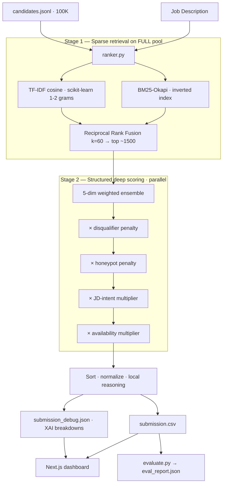

# NextHire — AI Recruiter Ranking Engine

A CPU-only, **network-free**, reproducible ranking system for the **Redrob Hackathon — Intelligent Candidate Discovery & Ranking Challenge**. It ranks the top-100 candidates from a **100,000-profile** pool against a Senior AI/ML Engineer JD, with fact-grounded reasoning for every pick — plus a premium Next.js recruiter dashboard and an offline evaluation harness.

> **Core insight (from the JD itself):** *"The right answer is not finding candidates whose skills section contains the most AI keywords — that's a trap we built into the dataset. The right answer involves reasoning about the gap between what the JD says and what the JD means."* NextHire is built around reading **profiles**, not keywords, and encoding the JD's **explicit intent** as scoring signals.

---

## ⚡ TL;DR — reproduce the submission

```bash
pip install -r ranker/requirements.txt          # numpy + scikit-learn only
make reproduce CANDIDATES=./candidates.jsonl OUT=./submission.csv
# or:  python ranker/ranker.py --input ./candidates.jsonl --output ./submission.csv
```

Ranking step: **~20s** on CPU for 100k candidates, **0 network calls**, **0 GPU**. Then:

```bash
make validate     # spec format check (100 rows, unique ranks, monotonic scores…)
make evaluate     # offline NDCG@10/50, MAP, P@10 + honeypot rate (proxy ground truth)
```

---

## 📁 Repository structure

```
nexthire/
├── README.md                    ← you are here
├── Makefile                     ← reproduce / evaluate / docker shortcuts
├── Dockerfile                   ← CPU-only, network-off containerised reproduction
├── submission.csv               ← the deliverable (top-100 ranking)
├── submission_metadata.yaml     ← portal metadata mirror (spec §10.3)
│
├── ranker/                      ← all ranking source (the engine)
│   ├── ranker.py                ← entrypoint + pipeline orchestration
│   ├── job_description.py       ← JD constants, weights, skill lists, intent keywords
│   ├── hybrid_ranker.py         ← BM25 + TF-IDF + (optional) dense + RRF fusion
│   ├── score_utils.py           ← skills / career / behavioral scoring + reasoning
│   ├── jd_intent.py             ← JD-intent multipliers (the "reads between the lines" layer)
│   ├── honeypot.py              ← impossible-profile (honeypot) detection
│   ├── evaluate.py              ← offline NDCG/MAP/P@10 + honeypot-rate harness
│   ├── precompute.py            ← optional, untimed index/cache prebuild
│   ├── validate.py              ← CSV format validator
│   ├── benchmark.py             ← performance benchmark suite
│   ├── worker.py                ← optional Redis background worker (dashboard only)
│   └── requirements.txt
│
├── docs/
│   ├── METHODOLOGY.md           ← design rationale + ablations (Stage 4/5 read)
│   ├── ppt.md                   ← presentation blueprint
│   └── submission_spec.pdf      ← the official spec (source of truth)
│
├── scripts/run.bat              ← Windows one-click runner
├── dataset/…                    ← candidates.json (gitignored), schema, reference docs
└── web/                         ← Next.js recruiter dashboard (sandbox/demo)
```

---

## 🏗️ Architecture & pipeline



**Final score**

```
raw   = 0.28·semantic + 0.28·skills + 0.22·career + 0.10·experience + 0.12·behavioral
final = raw × penalty_disqualifier × penalty_honeypot × mult_jd_intent × mult_availability
```

Additive ensemble for *fit*; multiplicative gates for *viability / reality / availability* — a fatal flaw suppresses the whole score instead of subtracting a slice.

---

## 🚀 Features

### 1. Two-stage retrieve-and-rerank
- **Stage 1 (full pool):** custom **BM25-Okapi** inverted index + **scikit-learn TF-IDF** (1–2 grams), fused via **Reciprocal Rank Fusion** → top ~1,500. Skips 98.5% of the pool from expensive scoring.
- **Stage 2 (shortlist):** deep structured scoring in parallel (`ProcessPoolExecutor`).
- **Optional dense pass:** sentence-transformer embeddings supported, run only in `precompute.py` so the timed ranking step stays sparse and fast.

### 2. Word-boundary skill matching (fixed a real bug)
Naive `keyword in text` matching made short codes false-match: `ann`→"ch**ann**el", `rag`→"sto**rag**e", `go`→"**Go**ogle", `map`→"**map**ping", `java`→"**java**script". This inflated skill scores pool-wide and *helped keyword-stuffer honeypots*. Now: phrases match as substrings; short tokens (≤4 chars) require **exact token** membership. A non-AI Operations Manager went from matching 3 must-have skills → **0**.

### 3. Five-dimension scoring ensemble
| Weight | Dimension | What it captures |
|:---:|---|---|
| 28% | Semantic | BM25 + TF-IDF (+ optional dense) via RRF |
| 28% | Skills | must/nice JD-skill overlap × proficiency × duration × endorsements × Redrob assessments |
| 22% | Career | title seniority, recency-weighted product-company trajectory, location, education tier |
| 10% | Experience | YoE fit, peaking at the JD's 5–9y sweet spot |
| 12% | Behavioral | recency, availability, responsiveness, engagement, GitHub, recruiter saves |

### 4. Disqualifier penalties (keyword-stuffing defense)
Wrong current role, consulting-only career (TCS/Infosys/…), keyword-trap (AI skills with no AI in career history), too-junior, job-hopping, salary-mismatch — each a multiplicative penalty with a human-readable reason.

### 5. Honeypot detection (Stage-3 DQ filter) — `honeypot.py`
Spec §7: ~80 honeypots with *subtly impossible profiles*, forced to tier 0; **>10% in your top-100 ⇒ disqualified**. We detect **internal contradictions** (no ID special-casing):
- total career months > 2× stated experience,
- a single role longer than the entire career,
- ≥5 "expert" skills with 0 months of usage.

> **Calibration we're proud of:** our first cut flagged **15,378** "honeypots" because one rule penalized professionals who earned a later degree *while working* (normal in India). We caught it via the eval harness, removed the rule, and landed on **~28** high-confidence, zero-false-positive detections. **Result: 0 honeypots in the submitted top-100.**

### 6. JD-intent layer — `jd_intent.py` (the differentiator)
The JD's *"What we mean"* and *"Things we explicitly do NOT want"* sections are how the ground truth was built, so we encode them directly as multipliers:
- **Penalties:** CV/speech/robotics with no NLP/IR; pure-research with no production; recent-LangChain-only with no pre-LLM depth.
- **Boosts:** demonstrable end-to-end shipping at scale; pre-LLM ML/IR fundamentals (XGBoost/LTR/classical IR); external validation (OSS/papers/strong GitHub).

Every top-10 placement now traces to an explicit JD sentence.

### 7. Availability multiplier (`ranker.py`)
The JD: *"a perfect-on-paper candidate who hasn't logged in for 6 months and has a 5% response rate is, for hiring purposes, not actually available — down-weight them appropriately."* Implemented as a multiplier on dormant + unresponsive + not-open candidates.

### 8. Local, fact-grounded reasoning (Stage-4 ready)
Short (CSV) and long (dashboard) rationales generated **locally** — no LLM, no network, nothing to hallucinate. Each is **rank-aware** (tone matches position), **JD-linked**, cites only **verified profile facts**, and states an **honest concern** where one exists (70/100 rows). Designed against the six Stage-4 reasoning checks.

### 9. Explainable AI (XAI) breakdowns
`submission_debug.json` carries per-candidate dimension scores, skill evidence, disqualifiers, penalties, and signed contribution deltas (e.g. `+12% JD-intent`, `−40% honeypot`) for the dashboard.

### 10. Offline evaluation harness — `evaluate.py`
The leaderboard is hidden (spec §8), and the JD wants engineers who *design eval frameworks (NDCG/MRR/MAP)* — so we built one. A rule-based **proxy ground truth** (relevance tiers 0–5, honeypots forced to 0) scored with the **official metric**:
```
composite = 0.50·NDCG@10 + 0.30·NDCG@50 + 0.15·MAP + 0.05·P@10
```
plus the honeypot-rate DQ check. Use it for **ablations and regression-catching** (deltas, not absolutes). See `docs/METHODOLOGY.md`.

---

## ✅ Compute compliance (spec §3)

| Constraint | Limit | NextHire |
|---|---|---|
| Runtime | ≤ 5 min | **~20s** (100k, warm cache) ✓ |
| Memory | ≤ 16 GB | within budget ✓ |
| Compute | CPU only, no GPU | CPU-only (`NEXTHIRE_ALLOW_GPU=0`) ✓ |
| Network | off | **no network calls in ranking path** ✓ |
| Disk | ≤ 5 GB intermediate | cache < 1.5 GB ✓ |

Determinism: stable tie-break `(-score, candidate_id)`; no RNG in the ranking path.

---

## 🔁 Reproducibility

```bash
make reproduce      # single command → submission.csv (the Stage-3 command)
make precompute     # optional, untimed: build index cache out of the timed run (spec §10.3)
make evaluate       # offline metrics + honeypot rate
make validate       # CSV format check
make docker-build   # build CPU-only, network-off image
make docker-run     # run the ranker in the container
```

`Dockerfile` pins CPU-only + network-off via env and installs only manylinux wheels (numpy, scikit-learn) — builds and runs unmodified, doubling as the mandatory sandbox (spec §10.5).

---

## 🖥️ Web dashboard (`web/`)

Premium pure-black monochrome recruiter console (Next.js App Router):
- ranked candidate list with score histogram, podium, and filters (search, min-score, work-mode, open-to-work);
- per-candidate drawer: radar score breakdown, career timeline, Redrob signals, long-form rationale, disqualifier/honeypot flags, XAI contributions;
- **offline-eval widget** (`/api/eval`) surfacing live NDCG/MAP/P@10 + honeypot rate;
- interactive weight sliders with real-time re-ranking (optional Redis worker, with a circuit-breaker fallback to direct subprocess).

```bash
cd web && npm install && npm run dev   # http://localhost:3000
```

---

## 📚 Further reading
- **`docs/METHODOLOGY.md`** — design rationale, scoring formula, honeypot calibration story, and ablation tables.
- **`docs/submission_spec.pdf`** — the official Redrob spec (source of truth).
- **`docs/ppt.md`** — presentation blueprint.

---

## 🧰 Dependencies
Core ranking step needs only **`numpy`** + **`scikit-learn`** (see `ranker/requirements.txt`). Redis, python-dotenv, sentence-transformers, torch, and psutil are **optional** (dashboard / precompute / benchmark) and guarded by import checks — their absence never breaks the ranking step.
