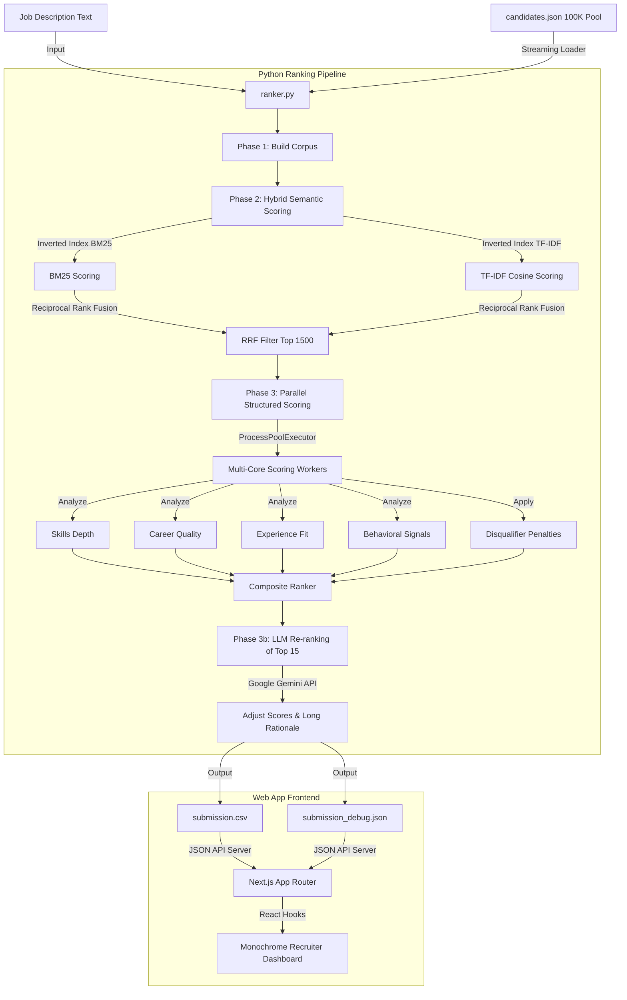

# NextHire: AI Recruiter Ranking Engine & Dashboard

NextHire is an end-to-end, high-performance hybrid semantic ranking system and web dashboard designed for the **Redrob Hackathon: AI Recruiter Challenge**. It parses a corpus of 100,000 candidates against a target Job Description (Senior AI/ML Engineer), computes highly accurate multi-dimensional fit scores, generates human-readable rationales, and visualizes the results on a premium monochrome interface.

---

## 🏗️ System Architecture & Data Flow

NextHire is structured into two main components:
1. **Python Ranking Pipeline (`/ranker`)**: A high-speed candidate search, scoring, and re-ranking engine.
2. **Next.js Recruiter Dashboard (`/web`)**: A premium, pure black monochrome web application to inspect and filter candidate metrics with zero-latency.



---

## ⚡ Performance & Data Loading Optimizations

The ranking pipeline and the web server are engineered to handle the **487MB candidate dataset (100,000 rows)** efficiently. We implement several optimizations to achieve sub-second query times and minimal memory footprint:

### 1. Inverted Indexing (Sparse Retrieval)
* **BM25 & TF-IDF Indices**: Both search algorithms in [hybrid_ranker.py](file:///d:/project/nexthire/ranker/hybrid_ranker.py) build an inverted index structure (`term -> list of matching (doc_id, tf)` postings) on the corpus.
* **Complexity Reduction**: Instead of running a linear search over all 100,000 documents, the engine only calculates scores for candidates that share at least one keyword with the job description. This reduces search time from minutes to milliseconds.

### 2. Stream-Based JSONL Parsers (Python & Node.js)
* **Python Generator Streaming**: In [ranker.py](file:///d:/project/nexthire/ranker/ranker.py), candidates are streamed line-by-line using a Python generator, avoiding loading the entire 487MB JSON array into heap memory at once.
* **Early-Exit Node.js Loader**: In the Next.js backend ([data.ts](file:///d:/project/nexthire/web/lib/data.ts)), the profile loader parses `candidates.json` line-by-line. The moment it collects the profile details for all 100 top candidates listed in `submission.csv`, it **exits the loop immediately**. This prevents reading the rest of the 487MB file, reducing API response times from over 5 seconds to under 2 seconds.

### 3. Two-Pass Retrieve-and-Rerank Strategy
* **First-Pass Filter**: Fast sparse retrieval (BM25 + TF-IDF) is run on the full 100K pool to select the top 1,500 candidates.
* **Second-Pass Scoring**: High-latency operations (like dense vector embeddings and parallel structured scoring rules) are executed **only** on this 1,500 subset, bypassing the other 98.5% of the database entirely.

### 4. Multi-Core Scoring Parallelism
* Leverages Python's `ProcessPoolExecutor` to distribute structured scoring rules (evaluating skills proficiency, career history, and notice periods) concurrently across all available CPU cores. This completes structured scoring for the 1,500 candidates in **1.8 seconds**.

---

## 📊 Detailed Scoring Rubric & Weights

Scores are compiled using a structured ensemble of **5 weighted components**:

| Weight | Dimension | Scoring Focus |
| :---: | :--- | :--- |
| **28%** | **Semantic Fit** | Lexical overlap with the target role description, fused via RRF. |
| **28%** | **Skills Depth** | Overlap of Must-Have and Nice-to-Have skills, weighted by proficiency level (Expert/Advanced), skill duration, endorsements, and assessments. |
| **22%** | **Career Quality** | Title seniorities, product company tenure ratio, location/relocation preferences, and education university tier. |
| **10%** | **Experience Fit** | Experience fit based on years of experience, peaking at the sweet spot of 5–9 years. |
| **12%** | **Behavioral Signals** | Notice period (≤30 days preferred), last active recency, response rates, and GitHub score. |

### 🚫 Disqualifiers & Multipliers (Penalty Layer)
To prevent keyword stuffing or bad placements, candidates are penalized using multipliers:
1. **Consulting/IT Services career (>85% tenure at consulting giants)**: Multiplied by `0.40` (60% penalty).
2. **Keyword Trap (listed AI skills but 0 mentions in career history)**: Multiplied by `0.50` (50% penalty).
3. **Junior Candidate (< 2 years of experience)**: Multiplied by `0.50` (50% penalty).
4. **Job-Hopping (average tenure < 14 months)**: Multiplied by `0.75` (25% penalty).
5. **Expected Salary (over 2x of target budget midpoint)**: Multiplied by `0.85` (15% penalty).

---

## 🚀 Running the Project

### 1. Setup & Installation
Ensure you have Python 3.9+ and Node.js 18+ installed on your system.

```bash
# Clone the repository
cd nexthire

# Install Python requirements (if using dense embeddings, optional)
pip install sentence-transformers numpy

# Install Web dependencies
cd web
npm install
```

### 2. Running the Python Ranker
You can run the ranker on either the small sample dataset (50 candidates) or the full candidate pool (100,000 candidates).

```bash
# Run on the SAMPLE dataset (creates sample_submission_out.csv)
python ranker/ranker.py --sample

# Run on the FULL dataset (creates submission.csv)
# Set GEMINI_API_KEY to activate cognitive LLM re-ranking
$env:GEMINI_API_KEY="your_api_key_here"  # Windows PowerShell
python ranker/ranker.py
```

### 3. Running the Web Dashboard
Start the Next.js development server to view the premium monochrome recruiter panel:

```bash
cd web
npm run dev
```
Open `http://localhost:3000` in your browser.

---

## 🎨 Recruiter Dashboard Highlights

* **Pure Black Monochrome Theme**: Designed with a sleek, premium developer aesthetic. No distracting colors—colors are used strictly for status/active signals (Green = Active/Verified, Amber = Warn, Red = Flag).
* **Zero Emojis, Pure SVGs**: Custom, clean inline vector graphic SVGs represent all tags, tabs, work modes, and action points.
* **Architecture Panel**: An expandable **Recruiter Engine Pillars & Architecture** drawer showcasing how search is parsed.
* **Interactive Filter Controls**: Search terms, slide minimum score cutoffs, filter by work-mode (Remote/Hybrid/Onsite), or filter for candidates actively "Open to work" in real-time.
* **AI Rationale Drawer**: Click any candidate to open a slide-out drawer containing a Radar Chart score breakdown, candidate career timeline, Redrob activity signals, and the long-form AI Rationale.
