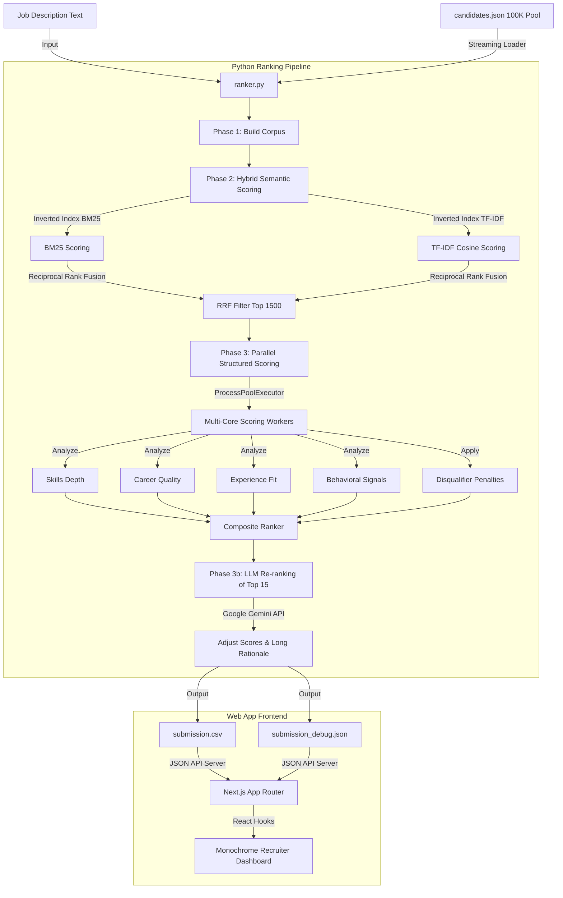

# NextHire Presentation Blueprint: AI Recruiter Ranking Engine & Dashboard

This document provides a slide-by-slide guide to help you build your presentation (PPT). Each slide corresponds directly to the details of the **NextHire** codebase and architecture.

---

## 📺 Slide 1: Title Slide
* **Slide Title**: NextHire: Enterprise-Grade AI Recruiter Discovery & Ranking Engine
* **Subtitle**: High-Performance Two-Stage Hybrid Retrieval & Multi-Core Re-Ranking Dashboard
* **Visual Ideas**: Sleek dark background, minimalist typography, NextHire logo graphic (monochrome/pure black developer aesthetic).
* **Presenter Notes**:
  * Welcome everyone. Today we are presenting NextHire, a high-performance system designed for the Redrob Hackathon: AI Recruiter Challenge.
  * NextHire scales to process over 100,000 candidates against a target Job Description in seconds, delivering explainable metrics and a premium, zero-latency dashboard.

---

## 📺 Slide 2: Solution Overview (What is it?)
* **Slide Title**: Solution Overview: Two-Stage Retrieve-and-Rerank
* **Core Concepts**:
  * **Unified Architecture**: Merges a fast Python candidate scoring backend with a Next.js App Router recruiter console.
  * **Hybrid Discovery Engine**: Fuses exact keyword matching (sparse) with deep contextual semantic matching (dense).
  * **Cognitive Reranking Layer**: Leverages LLMs (Google Gemini API) to perform final qualitative adjustments ($\pm 0.05$) and write detailed rationales for finalist candidates.
  * **Explainable AI (XAI)**: Breaks down candidate scores into explicit, readable dimension percentages directly on the recruiter UI.
* **Bullet Points**:
  * **Two-Stage Pipeline**: Filters 100K candidates to 1,500 using fast sparse index retrieval, then runs CPU-heavy structured scoring.
  * **Asynchronous Queueing**: Decouples search execution via a Redis job list, streaming stdout logs via Pub/Sub.
  * **Zero-Latency Dashboard**: Pure black developer theme with real-time weights tuning, interactive radar charts, and candidate timeline logs.

---

## 📺 Slide 3: Solution Differentiation (How we differ?)
* **Slide Title**: Key Differentiators from Traditional Systems
* **Comparison Table**:

| Feature | Traditional Systems | NextHire Engine |
| :--- | :--- | :--- |
| **Search Paradigm** | Simple keyword lookup | **Hybrid (BM25 + TF-IDF + Dense Vector Search)** |
| **Vocabulary Gap** | Misses fits due to different words | **Skill Synonym Expansion Graph** (e.g. `React` $\leftrightarrow$ `Next.js`) |
| **Experience Fit** | Flat linear years cutoff | **Bell-Curve Fit Function** (Sweet-spot peak at 5-9 YoE) |
| **Integrity Checks** | Susceptible to keyword stuffing | **Keyword-Trap & Job-Hopper Penalty Multipliers** |
| **Explainability** | Black-box ranking score | **Explainable AI (XAI)** dimensional score delta breakdown |
| **Performance** | O(N) linear scans | **Inverted Index Sparse Lookup + Redis Caching** |

---

## 📺 Slide 4: Job Description (JD) Understanding
* **Slide Title**: JD Understanding: Senior AI/ML Engineer
* **Core Requirements Extracted**:
  * **Target Seniority**: 5–9 Years of Experience (the system's peak score sweet-spot).
  * **Must-Have Core Skills**: Embeddings (BGE/E5), Vector Search (FAISS/HNSW), Vector Databases (Pinecone/Weaviate/Milvus/Elasticsearch), NLP/IR (BM25/Ranking/Retrieval), LLM Tuning (LoRA/QLoRA/PEFT/RAG), Offline Evaluation (NDCG/MRR/MAP).
  * **Nice-to-Have Adjacent Skills**: PyTorch/TensorFlow, Recommendation systems, Distributed Systems (Kafka/Spark), DevOps (Docker/Kubernetes).
  * **Career Domain**: Strong preference for AI/ML roles in *product companies*, not IT services or consulting.
  * **Target Locations**: Noida, Pune, Hyderabad, Mumbai, Delhi, NCR, Bangalore (India).

---

## 📺 Slide 5: Multi-Dimensional Candidate Evaluation
* **Slide Title**: Beyond Keyword Matching: Candidate Evaluation Signals
* **Core Concepts**:
  * **Skills Depth (Weighted)**: Matches skills from candidate's profile against MUST_HAVE and NICE_TO_HAVE list, but scales them by **proficiency level** (Expert = 1.0, Advanced = 0.85, Intermediate = 0.65, Beginner = 0.35) and **duration in months** to check sustained use.
  * **Career Quality**: Tracks job titles, company sizes, and filters consulting-heavy history. Uses **Recency Weighting** (most recent job gets a $1.6x$ multiplier, second job gets $1.3x$, older jobs get $1.0x$).
  * **Platform Behavioral Signals (Redrob Platform)**: Incorporates notice period (prefers $\le30$ days), profile completeness, response rate to recruiters, average response time, interview completion rate, and GitHub activity scores.

---

## 📺 Slide 6: Structured Penalty Layer (Disqualifiers)
* **Slide Title**: Preventing Exploitation: The Multiplier Penalty Layer
* **Bullet Points**:
  * **IT Services / Consulting Career Filter**: Career predominantly in IT services/consulting ($>85\%$ total tenure at TCS, Infosys, Wipro, Accenture, etc.) triggers a **$0.40$ multiplier** (60% penalty).
  * **Keyword-Trap Detector**: Candidates listing premium AI skills but having **zero mentions** of any AI/ML keywords in their career descriptions are hit with a **$0.50$ multiplier** (50% penalty).
  * **Junior Candidates**: Less than 2 years of experience triggers a **$0.50$ multiplier** (50% penalty).
  * **Job-Hopping Detector**: Average tenure $< 14$ months with $\ge 2$ short stints triggers a **$0.75$ multiplier** (25% penalty).
  * **Salary Mismatch**: Expected salary $> 2x$ of target budget midpoint (40 LPA) triggers a **$0.85$ multiplier** (15% penalty).

---

## 📺 Slide 7: Retrieval & Ranking Methodology
* **Slide Title**: The 3-Step Search, Scoring, & Sorting Pipeline
* **Visual Diagram (Flow)**:
  $$\text{100,000 Candidate Pool} \xrightarrow{\text{Stage 1: Sparse Retrieval (BM25 + TF-IDF) \& Dense Vector}} \text{Top 1,500 Subset} \xrightarrow{\text{Stage 2: Multi-Core Scoring Rubric}} \text{Top 15 Finalists} \xrightarrow{\text{Stage 3: LLM Cognitive Re-rank}} \text{Monotonic Normalization [0.10, 0.999]}$$
* **Core Concepts**:
  * **Inverted Indices**: Search avoids linear scanning by looking up token posting lists.
  * **Reciprocal Rank Fusion (RRF)**:
    $$RRF(d) = \sum_{m \in M} \frac{1}{60 + \text{rank}_m(d)}$$
    Fuses BM25 scoring, TF-IDF cosine matching, and Sentence-Transformers (`all-MiniLM-L6-v2`) dense dot products into a single rank score.
  * **Multi-Core Parallel Execution**: Concurrently evaluates the 5-dimension scoring rubric on the top 1,500 candidates.

---

## 📺 Slide 8: The 5-Dimension Scoring Rubric
* **Slide Title**: Scoring Breakdown & Weight Distribution
* **Visual Ideas**: Pie chart or bar chart representing weights:

```
  ┌──────────────────────────────────────────────────────────┐
  │  [28%] Semantic Relevance (Sparse + Dense Match)        │
  ├──────────────────────────────────────────────────────────┤
  │  [28%] Skills Depth (Proficiency, Duration, Endorsement) │
  ├──────────────────────────────────────────────────────────┤
  │  [22%] Career Quality (Company Tiers, Trajectory, Title) │
  ├──────────────────────────────────────────────────────────┤
  │  [12%] Behavioral Profile (Availability, Recency, Resp) │
  ├──────────────────────────────────────────────────────────┤
  │  [10%] Experience Fit (Bell-curve years of experience)   │
  └──────────────────────────────────────────────────────────┘
```
* **Formula**:
  $$\text{Raw Score} = \left(\sum \text{Dimension Weight} \times \text{Dimension Score}\right) \times \text{Disqualifier Multipliers}$$
  $$\text{Final Score} = \text{MonotonicNormalize}(\text{Raw Score} + \text{LLM Adjustment})$$

---

## 📺 Slide 9: Explainability (XAI) & Rationale Generation
* **Slide Title**: Explainable AI: Demystifying Recommendations
* **Core Concepts**:
  * **Explainable AI (XAI) Deltas**: In the debug sidecar and visual dashboard, every candidate shows their exact contribution list (e.g. `+0.22 Semantic Relevance`, `-0.15 Disqualifier Penalty`).
  * **CSV Short Reasoning**: Compact recruiter-style explanations under 200 characters containing: *Current title, years of experience, key skills, notice period, and active platform flags*.
  * **hallucination Prevention**:
    * **Zero-Hallucination Fallback Layer**: If Google Gemini API keys are missing, timeout, or rate-limit, the system automatically triggers a **fully deterministic rule-based text generator** written in pure Python.
    * **Strict Temperature**: Set to `0.2` in JSON mode, feeding only factual candidate fields and the exact JD requirements to prevent creative generation.

---

## 📺 Slide 10: System Architecture
* **Slide Title**: System Architecture & Data Flow



---

## 📺 Slide 11: Production-Grade Reliability & Cache Scaling
* **Slide Title**: Production Infrastructure: Redis Caching & Worker Queues
* **Bullet Points**:
  * **Redis Caching Layer**: Precomputed candidate embeddings and tokenized TF-IDF indices are cached in Redis. Recalculation runs bypass parsing and execute in **~3.6 seconds**.
  * **Distributed Task Queue**: Search and recalculation requests are pushed onto a Redis queue (`nexthire:queue`) and picked up by a Python background daemon worker (`worker.py`).
  * **Real-Time Log Streaming**: Next.js route subscribes to job updates via Redis Pub/Sub, streaming server logs live to the browser console.
  * **Subprocess Circuit Breaker**: If Redis is not running, Next.js instantly activates a circuit breaker and spawns a local Python subprocess directly to guarantee 100% dashboard availability.

---

## 📺 Slide 12: Results & Performance Benchmarks
* **Slide Title**: Real-World Performance & Computational Scaling
* **Benchmark Results**:

| Metric | Result | Why It Scaled |
| :--- | :--- | :--- |
| **Dataset Size** | 487 MB (100,000+ candidates) | **Stream-Based Generators** (flat memory footprint) |
| **Sparse Retrieval** | Millisecond-level (< 0.5 ms) | **Custom Inverted Index** (bypasses linear scans) |
| **Structured Re-Ranking** | ~1.8 seconds (for N=1,500) | **Multi-Core Python Execution** (`ProcessPoolExecutor`) |
| **Redis Cache Recalculation** | **~3.6 seconds** (down from 66s) | **Serialization caching** of parsed TF-IDF indices |
| **Next.js API response** | < 2 seconds | **Early-Exit profile loader** (closes file after top-100) |

---

## 📺 Slide 13: Technologies & Frameworks Used
* **Slide Title**: NextHire Stack: Why We Selected These Technologies
* **Core Technologies**:
  * **Python 3.9+**: The industry standard for ML data wrangling, offering multiprocessing executors (`ProcessPoolExecutor`).
  * **scikit-learn & Sentence-Transformers**: Fast numeric TF-IDF matching and high-quality vector embeddings (`all-MiniLM-L6-v2`) supporting CUDA GPU acceleration.
  * **Annoy (Spotify)**: Efficient angular Approximate Nearest Neighbor search on high-dimensional vectors.
  * **Redis**: Decoupled caching store and Pub/Sub event broker to manage async worker pipelines.
  * **Next.js 15, React 19, TypeScript**: Responsive modern framework enabling server-side data loading and strict type safety.
  * **Google Gemini 2.0 API**: Restful lightweight cognitive matching utilizing JSON mode for structured reasoning output.

---

## 📺 Slide 14: Recruiter Dashboard Highlights
* **Slide Title**: User Experience: Premium monochrome Recruiter Panel
* **Key Features**:
  * **Zero Emojis, Pure SVGs**: Restrained black-monochrome design where colors (Green/Amber/Red) are reserved exclusively for critical status markers (Verified, Warnings, Disqualifier Flags).
  * **Interactive Weights Tuner**: Allows recruiters to dynamically shift the weight percentages of Semantic, Skills, Career, Experience, and Behavioral metrics in real-time.
  * **Radar Chart Breakdown**: Visualizes a candidate's strengths across the 5 core metric dimensions.
  * **Recruiter Engine Pillars**: Expandable architecture panel explaining underlying scoring.

---

## 📺 Slide 15: Future Roadmap
* **Slide Title**: Future System Scalability Roadmap
* **Bullet Points**:
  * **Sharded ANN Vector Indices**: Grouping FAISS or HNSW index shards by geo-regions or core skills to parallelize vector queries.
  * **Incremental Memory Updates**: Maintain active index alterations in memory, avoiding index rebuild overhead when individual profiles are updated.
  * **GPU-Accelerated Reranking**: Compiling dense embedding models using ONNX Runtime/TensorRT to utilize server GPUs.
  * **Recruiter Feedback Reinforcement Loop**: Tuning static metrics weights based on recruiter shortlists, clicks, and hide patterns.
